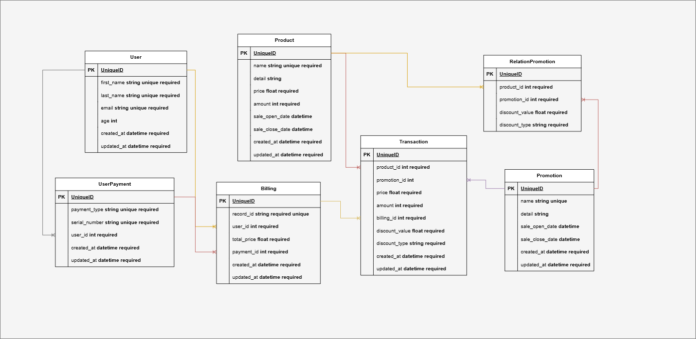

- **User Model:**

  - ใช้สำหรับเก็บข้อมูลส่วนตัวของ `user`

- **UserPayment Model:**

  - ใช้สำหรับเก็บวิธีในการชำระเงินของ `user`

- **Product Model:**

  - ใช้สำหรับเก็บ ชื่อสินค้า, รายละเอียดสินค้า, ราคาขาย, จำนวนสินค้า, วันที่เปิดขาย, วันที่เลิกขาย

- **Promotion Model:**

  - ใช้สำหรับเก็บ ชื่อโปรโมชั่น, รายละเอียดโปรโมชั่น, วันที่เปิดโปรโมชั่น, วันที่เลิกโปรโมชั่น

- **RelationPromotion Model:**

  - ใช้สำหรับเอาไว้ map โปรโมชั่นกับสินค้า และสามารถทำส่วนลดได้หลายรูปที่ทั้งที่ลดค่าคงที่หรือแบบ `%`
  - เป็นตัวกลางในการเชื่อมโยง Product กับ Promotion

- **Transaction Model:**

  - ใช้สำหรับเก็บ ธุรกรรมการซื้อสินค้าแต่ละชิ้นว่าได้ส่วนลดหรือจำนวนเท่าไหร่

- **Billing Model:**

  - ใช้สำหรับเก็บ ทุกธุรกรรมการซื้อสินค้าทุกในแต่ละครั้งของ `user` ซึ่งจะ map กับธุรกรรมสินค้า
